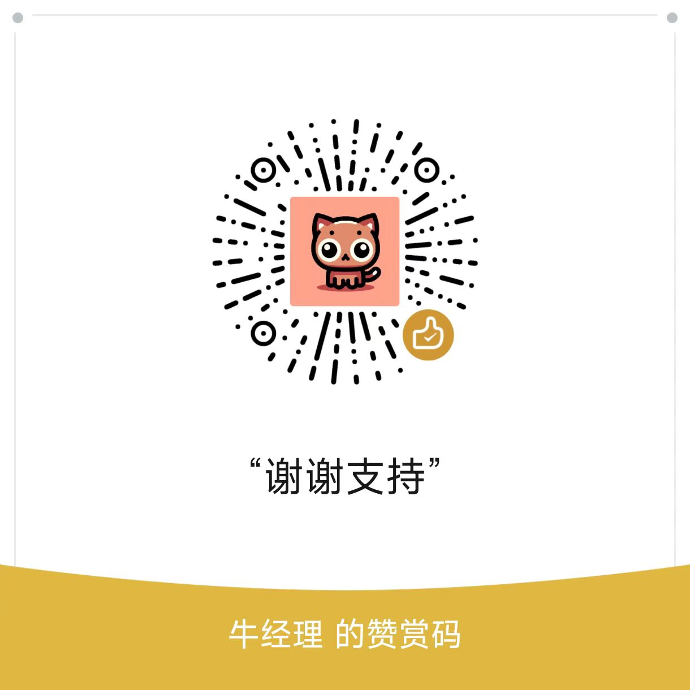

# 视频字幕提取器 (Video Subtitle Extractor)

<p align="center">
    
</p>

<p align="center">
    <a href="#安装说明">安装说明</a> •
    <a href="#使用指南">使用指南</a> •
    <a href="#功能特点">功能特点</a> •
    <a href="#支持平台">支持平台</a> •
    <a href="#常见问题">常见问题</a>
</p>

> 一个强大而简单的视频字幕提取工具，支持多平台视频字幕提取和格式转换。

## ✨ 功能特点

### 🎯 核心功能
- 支持多平台视频字幕提取
- 自动检测视频可用字幕
- 支持手动和自动生成字幕
- 多语言字幕选择
- 字幕格式转换（SRT转纯文本）

### 🌟 特色优势
- 简单的命令行界面
- 无需平台账号
- 智能字幕处理
- 批量转换支持

## 📦 安装说明

### 环境要求
- Python 3.6+
- pip 包管理器
- 稳定的网络连接

### 安装步骤

1. **安装 Python**
```bash
# 访问 https://www.python.org/downloads/ 下载并安装 Python
python --version  # 验证安装
```

2. **安装依赖**
```bash
pip install yt-dlp
```

3. **下载本项目**
```bash
git clone https://github.com/yourusername/video-subtitle-extractor.git
cd video-subtitle-extractor
```

## 🚀 使用指南

### 字幕提取工具

运行视频字幕提取器：
```bash
python video_subtitle_extractor.py
```

### 字幕转换工具

运行字幕格式转换器：
```bash
python subtitle_converter.py
```

### 使用流程

1. **视频字幕提取**
   ```bash
   请输入视频URL: https://www.youtube.com/watch?v=example
   
   视频信息:
   标题: 示例视频
   平台: Youtube
   时长: 10分钟30秒
   
   可用的字幕:
   手动字幕: en, zh-CN, ja
   自动字幕: en, zh-Hans, ja
   ```

2. **字幕格式转换**
   ```bash
   字幕转换工具
   1. 转换单个文件
   2. 批量转换目录
   3. 退出
   ```

## 🌍 支持平台

### 主流视频平台
| 平台 | 支持状态 | 备注 |
|------|----------|------|
| YouTube | ✅ | 支持字幕下载 |
| Bilibili | ✅ | 支持CC字幕 |
| 抖音 | ✅ | 支持自动字幕 |
| 西瓜视频 | ✅ | 基础支持 |
| Vimeo | ✅ | 支持CC字幕 |

### 字幕格式支持
- SRT 字幕文件
- VTT 字幕文件
- TXT 纯文本文件

## 💡 使用技巧

### 字幕语言选择
常用语言代码参考：
```
zh-CN : 简体中文
zh-TW : 繁体中文
en    : 英语
ja    : 日语
ko    : 韩语
```

### 批量处理建议
1. 准备视频URL列表文件
2. 使用循环命令处理
3. 设置统一输出目录

### 最佳实践
- 优先选择手动字幕
- 使用UTF-8编码查看文件
- 定期备份重要字幕文件

## ❓ 常见问题

<details>
<summary>1. 无法获取字幕？</summary>

- 检查视频是否有字幕
- 确认网络连接正常
- 验证URL是否正确
- 尝试使用代理
</details>

<details>
<summary>2. 字幕显示乱码？</summary>

- 使用支持UTF-8的编辑器
- 尝试使用VSCode或Notepad++
- 检查系统默认编码
</details>

<details>
<summary>3. 下载速度很慢？</summary>

- 检查网络连接
- 考虑使用代理服务器
- 尝试非高峰时段下载
</details>

## 📝 更新日志

### v1.1.0 (2024-03-21)
- 新增字幕格式转换功能
- 优化字幕提取逻辑
- 增加更多平台支持

### v1.0.0 (2024-03-20)
- 首次发布
- 基础字幕提取功能
- 多平台支持

## 🔜 开发计划

- [ ] 图形用户界面
- [ ] 字幕翻译功能
- [ ] 更多字幕格式支持
- [ ] 自定义输出模板
- [ ] 字幕时间轴编辑

## 🤝 贡献指南

欢迎贡献代码和提出建议！

1. Fork 本仓库
2. 创建特性分支
3. 提交改动
4. 发起 Pull Request

## 📄 许可证

本项目采用 MIT 许可证 - 详见 [LICENSE](LICENSE) 文件

## 🙏 致谢

- [yt-dlp](https://github.com/yt-dlp/yt-dlp)
- 所有贡献者和用户

---

<p align="center">如果这个项目帮助到你，欢迎 ⭐️ Star 支持！</p>

<p align="center">
    
    <br>
    <i>如果觉得有帮助，可以请我喝杯咖啡 ☕️</i>
</p>